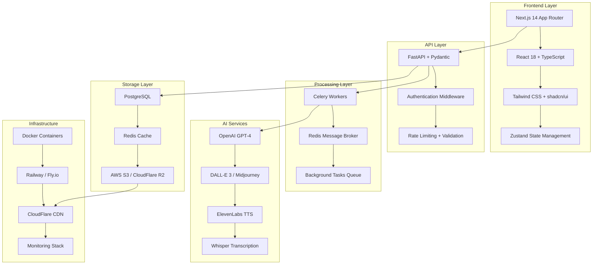

# 🛠️ Stack Tecnológico Completo - Book2Video

## 📋 Visão Geral da Arquitetura



---

## 🎨 Frontend Stack

### **Core Framework**
```javascript
// Next.js 14 com App Router
{
  "framework": "Next.js 14.2+",
  "runtime": "Node.js 20+",
  "typescript": "5.4+",
  "react": "18.2+"
}
```

### **UI/UX Libraries**
```json
{
  "styling": {
    "primary": "Tailwind CSS 3.4+",
    "components": "shadcn/ui",
    "icons": "Lucide React",
    "animations": "Framer Motion"
  },
  "forms": {
    "validation": "React Hook Form + Zod",
    "file_upload": "React Dropzone"
  },
  "video": {
    "player": "Video.js / React Player",
    "preview": "Canvas API"
  }
}
```

### **State Management & Data Fetching**
```javascript
// Zustand para estado global
import { create } from 'zustand'
import { devtools, persist } from 'zustand/middleware'

// React Query para server state
import { useQuery, useMutation } from '@tanstack/react-query'

// Axios para HTTP client
import axios from 'axios'
```

### **Package.json Frontend**
```json
{
  "dependencies": {
    "next": "^14.2.0",
    "react": "^18.2.0",
    "react-dom": "^18.2.0",
    "typescript": "^5.4.0",
    "tailwindcss": "^3.4.0",
    "@radix-ui/react-*": "latest",
    "class-variance-authority": "^0.7.0",
    "clsx": "^2.1.0",
    "tailwind-merge": "^2.3.0",
    "zustand": "^4.5.0",
    "@tanstack/react-query": "^5.28.0",
    "axios": "^1.6.0",
    "react-hook-form": "^7.51.0",
    "zod": "^3.22.0",
    "react-dropzone": "^14.2.0",
    "framer-motion": "^11.0.0",
    "lucide-react": "^0.363.0",
    "video.js": "^8.10.0"
  },
  "devDependencies": {
    "@types/node": "^20.12.0",
    "@types/react": "^18.2.0",
    "eslint": "^8.57.0",
    "eslint-config-next": "^14.2.0",
    "prettier": "^3.2.0",
    "@tailwindcss/typography": "^0.5.0"
  }
}
```

---

## ⚡ Backend Stack

### **Core Framework**
```python
# FastAPI com async/await
from fastapi import FastAPI, BackgroundTasks, UploadFile
from fastapi.middleware.cors import CORSMiddleware
from fastapi.middleware.gzip import GZipMiddleware
import uvicorn
```

### **Dependencies & Libraries**
```python
# requirements.txt
fastapi==0.110.0
uvicorn[standard]==0.29.0
pydantic==2.6.0
sqlalchemy==2.0.28
alembic==1.13.0
psycopg2-binary==2.9.9
redis==5.0.3
celery==5.3.6
boto3==1.34.0
python-multipart==0.0.9
python-jose[cryptography]==3.3.0
passlib[bcrypt]==1.7.4
openai==1.14.0
elevenlabs==0.2.26
requests==2.31.0
pillow==10.2.0
moviepy==1.0.3
ffmpeg-python==0.2.0
pypdf2==3.0.1
python-docx==1.1.0
ebooklib==0.18
whisper==1.1.10
```

### **Database & ORM**
```python
# SQLAlchemy 2.0 com async
from sqlalchemy.ext.asyncio import create_async_engine, AsyncSession
from sqlalchemy.orm import DeclarativeBase, Mapped, mapped_column
import asyncio

class Base(DeclarativeBase):
    pass

# Modelos principais
class User(Base):
    __tablename__ = "users"
    id: Mapped[int] = mapped_column(primary_key=True)
    email: Mapped[str] = mapped_column(unique=True)
    created_at: Mapped[datetime]

class VideoProject(Base):
    __tablename__ = "video_projects"
    id: Mapped[str] = mapped_column(primary_key=True)  # UUID
    user_id: Mapped[int] = mapped_column(ForeignKey("users.id"))
    status: Mapped[str]  # pending, processing, completed, failed
    duration_minutes: Mapped[int]
    file_path: Mapped[str]
    result_url: Mapped[str | None]
```

### **Background Processing**
```python
# Celery configuration
from celery import Celery

app = Celery('book2video')
app.config_from_object('celeryconfig')

# Worker tasks
@app.task(bind=True)
def process_book_to_video(self, project_id: str):
    try:
        # Update status
        self.update_state(state='PROGRESS', meta={'step': 'parsing'})
        
        # Process pipeline
        content = parse_uploaded_file(project_id)
        self.update_state(state='PROGRESS', meta={'step': 'summarizing'})
        
        summary = generate_summary(content)
        self.update_state(state='PROGRESS', meta={'step': 'generating_images'})
        
        images = generate_scene_images(summary)
        self.update_state(state='PROGRESS', meta={'step': 'generating_audio'})
        
        audio = generate_narration(summary)
        self.update_state(state='PROGRESS', meta={'step': 'creating_video'})
        
        video_url = create_final_video(images, audio)
        
        return {'status': 'SUCCESS', 'result': video_url}
    except Exception as exc:
        raise self.retry(exc=exc, countdown=60, max_retries=3)
```

---

## 🤖 AI Services Integration

### **OpenAI Integration**
```python
import openai
from typing import List, Dict

class OpenAIService:
    def __init__(self):
        self.client = openai.AsyncOpenAI()
    
    async def generate_summary(self, content: str, duration: int) -> Dict:
        word_count = duration * 120  # 120 words per minute
        
        response = await self.client.chat.completions.create(
            model="gpt-4-turbo-preview",
            messages=[
                {
                    "role": "system",
                    "content": f"""Você é um roteirista especializado em adaptar livros para vídeos.
                    Crie um roteiro de aproximadamente {word_count} palavras dividido em cenas.
                    Retorne em formato JSON com as cenas numeradas."""
                },
                {"role": "user", "content": content}
            ],
            response_format={"type": "json_object"}
        )
        
        return response.choices[0].message.content
    
    async def generate_image_prompt(self, scene: str) -> str:
        response = await self.client.chat.completions.create(
            model="gpt-4-turbo-preview",
            messages=[
                {
                    "role": "system",
                    "content": "Transforme esta cena em um prompt detalhado para DALL-E 3"
                },
                {"role": "user", "content": scene}
            ]
        )
        
        return response.choices[0].message.content

    async def generate_scene_image(self, prompt: str) -> str:
        response = await self.client.images.generate(
            model="dall-e-3",
            prompt=prompt,
            size="1024x1024",
            quality="standard",
            n=1
        )
        
        return response.data[0].url
```

### **ElevenLabs TTS Integration**
```python
from elevenlabs import Voice, VoiceSettings, generate, save
import asyncio

class TTSService:
    def __init__(self):
        self.voice = Voice(
            voice_id="21m00Tcm4TlvDq8ikWAM",  # Rachel voice
            settings=VoiceSettings(
                stability=0.71,
                similarity_boost=0.5,
                style=0.0,
                use_speaker_boost=True
            )
        )
    
    async def generate_narration(self, text: str) -> bytes:
        audio = generate(
            text=text,
            voice=self.voice,
            model="eleven_multilingual_v2"
        )
        
        return audio
    
    async def save_audio_file(self, audio: bytes, filepath: str):
        save(audio, filepath)
```

---

## 🎬 Video Processing Stack

### **MoviePy Integration**
```python
from moviepy.editor import *
from moviepy.config import change_settings
import numpy as np

class VideoProcessor:
    def __init__(self):
        # Configure MoviePy para usar ffmpeg
        change_settings({"FFMPEG_BINARY": "/usr/local/bin/ffmpeg"})
    
    async def create_scene_clip(self, image_path: str, audio_path: str) -> VideoClip:
        # Carregar imagem e áudio
        img_clip = ImageClip(image_path)
        audio_clip = AudioFileClip(audio_path)
        
        # Ajustar duração da imagem ao áudio
        img_clip = img_clip.set_duration(audio_clip.duration)
        
        # Adicionar efeitos sutis
        img_clip = img_clip.resize(height=720)  # 720p
        img_clip = img_clip.fx(lambda clip: clip.crossfadein(0.5).crossfadeout(0.5))
        
        # Combinar imagem e áudio
        final_clip = img_clip.set_audio(audio_clip)
        
        return final_clip
    
    async def combine_scenes(self, scene_clips: List[VideoClip]) -> VideoClip:
        # Concatenar todas as cenas
        final_video = concatenate_videoclips(scene_clips, method="compose")
        
        # Adicionar música de fundo (opcional)
        if background_music:
            bg_music = AudioFileClip(background_music).volumex(0.3)
            bg_music = bg_music.set_duration(final_video.duration)
            final_audio = CompositeAudioClip([final_video.audio, bg_music])
            final_video = final_video.set_audio(final_audio)
        
        return final_video
    
    async def export_video(self, video_clip: VideoClip, output_path: str):
        video_clip.write_videofile(
            output_path,
            fps=24,
            codec='libx264',
            audio_codec='aac',
            temp_audiofile='temp-audio.m4a',
            remove_temp=True,
            preset='medium',
            threads=4
        )
```

---

## 💾 Storage & Database

### **PostgreSQL Schema**
```sql
-- Users table
CREATE TABLE users (
    id SERIAL PRIMARY KEY,
    email VARCHAR(255) UNIQUE NOT NULL,
    password_hash VARCHAR(255) NOT NULL,
    subscription_tier VARCHAR(50) DEFAULT 'free',
    created_at TIMESTAMP DEFAULT NOW(),
    updated_at TIMESTAMP DEFAULT NOW()
);

-- Video projects table
CREATE TABLE video_projects (
    id UUID PRIMARY KEY DEFAULT gen_random_uuid(),
    user_id INTEGER REFERENCES users(id),
    title VARCHAR(255) NOT NULL,
    original_filename VARCHAR(255) NOT NULL,
    file_path VARCHAR(500) NOT NULL,
    duration_minutes INTEGER NOT NULL,
    style VARCHAR(50) DEFAULT 'default',
    voice_id VARCHAR(100) DEFAULT 'default',
    status VARCHAR(50) DEFAULT 'pending',
    processing_progress INTEGER DEFAULT 0,
    result_url VARCHAR(500),
    error_message TEXT,
    created_at TIMESTAMP DEFAULT NOW(),
    completed_at TIMESTAMP,
    cost_dollars DECIMAL(10,4) DEFAULT 0.00
);

-- Usage tracking
CREATE TABLE usage_logs (
    id SERIAL PRIMARY KEY,
    user_id INTEGER REFERENCES users(id),
    action VARCHAR(100) NOT NULL,
    resource_used VARCHAR(100),
    cost_dollars DECIMAL(10,4) DEFAULT 0.00,
    created_at TIMESTAMP DEFAULT NOW()
);

-- Indexes for performance
CREATE INDEX idx_video_projects_user_id ON video_projects(user_id);
CREATE INDEX idx_video_projects_status ON video_projects(status);
CREATE INDEX idx_usage_logs_user_date ON usage_logs(user_id, created_at);
```

### **Redis Configuration**
```python
import redis.asyncio as redis
from typing import Optional
import json

class CacheService:
    def __init__(self):
        self.redis = redis.from_url("redis://localhost:6379")
    
    async def set_processing_status(self, project_id: str, status: dict):
        key = f"processing:{project_id}"
        await self.redis.setex(key, 3600, json.dumps(status))  # 1 hour TTL
    
    async def get_processing_status(self, project_id: str) -> Optional[dict]:
        key = f"processing:{project_id}"
        data = await self.redis.get(key)
        return json.loads(data) if data else None
    
    async def cache_generated_image(self, prompt_hash: str, image_url: str):
        key = f"image_cache:{prompt_hash}"
        await self.redis.setex(key, 86400 * 7, image_url)  # 7 days TTL
```

---

## 🔐 Authentication & Security

### **Auth Implementation**
```python
from passlib.context import CryptContext
from jose import JWTError, jwt
from datetime import datetime, timedelta
import secrets

pwd_context = CryptContext(schemes=["bcrypt"], deprecated="auto")

class AuthService:
    SECRET_KEY = secrets.token_urlsafe(32)
    ALGORITHM = "HS256"
    ACCESS_TOKEN_EXPIRE_MINUTES = 30
    
    @classmethod
    def verify_password(cls, plain_password: str, hashed_password: str) -> bool:
        return pwd_context.verify(plain_password, hashed_password)
    
    @classmethod
    def get_password_hash(cls, password: str) -> str:
        return pwd_context.hash(password)
    
    @classmethod
    def create_access_token(cls, data: dict) -> str:
        to_encode = data.copy()
        expire = datetime.utcnow() + timedelta(minutes=cls.ACCESS_TOKEN_EXPIRE_MINUTES)
        to_encode.update({"exp": expire})
        
        return jwt.encode(to_encode, cls.SECRET_KEY, algorithm=cls.ALGORITHM)

# Rate limiting
from slowapi import Limiter, _rate_limit_exceeded_handler
from slowapi.util import get_remote_address
from slowapi.errors import RateLimitExceeded

limiter = Limiter(key_func=get_remote_address)
app.state.limiter = limiter
app.add_exception_handler(RateLimitExceeded, _rate_limit_exceeded_handler)

@app.post("/generate-video")
@limiter.limit("2/minute")  # Max 2 video generations per minute
async def generate_video_endpoint(request: Request, ...):
    pass
```

---

## 📦 Infrastructure & Deployment

### **Docker Configuration**
```dockerfile
# Dockerfile.backend
FROM python:3.11-slim

# Install system dependencies
RUN apt-get update && apt-get install -y \
    ffmpeg \
    libsm6 \
    libxext6 \
    libfontconfig1 \
    libxrender1 \
    libgl1-mesa-glx \
    && rm -rf /var/lib/apt/lists/*

WORKDIR /app

# Install Python dependencies
COPY requirements.txt .
RUN pip install --no-cache-dir -r requirements.txt

COPY . .

EXPOSE 8000

CMD ["uvicorn", "main:app", "--host", "0.0.0.0", "--port", "8000"]
```

```dockerfile
# Dockerfile.worker
FROM python:3.11-slim

# Same base setup as backend
RUN apt-get update && apt-get install -y ffmpeg && rm -rf /var/lib/apt/lists/*

WORKDIR /app
COPY requirements.txt .
RUN pip install --no-cache-dir -r requirements.txt

COPY . .

CMD ["celery", "worker", "-A", "celery_app", "--loglevel=info", "--concurrency=2"]
```

### **Docker Compose**
```yaml
version: '3.8'

services:
  frontend:
    build: ./frontend
    ports:
      - "3000:3000"
    environment:
      - NEXT_PUBLIC_API_URL=http://backend:8000
    
  backend:
    build:
      context: ./backend
      dockerfile: Dockerfile.backend
    ports:
      - "8000:8000"
    environment:
      - DATABASE_URL=postgresql://user:pass@db:5432/book2video
      - REDIS_URL=redis://redis:6379
      - OPENAI_API_KEY=${OPENAI_API_KEY}
      - ELEVENLABS_API_KEY=${ELEVENLABS_API_KEY}
    depends_on:
      - db
      - redis
    
  worker:
    build:
      context: ./backend
      dockerfile: Dockerfile.worker
    environment:
      - DATABASE_URL=postgresql://user:pass@db:5432/book2video
      - REDIS_URL=redis://redis:6379
      - OPENAI_API_KEY=${OPENAI_API_KEY}
      - ELEVENLABS_API_KEY=${ELEVENLABS_API_KEY}
    depends_on:
      - db
      - redis
    
  db:
    image: postgres:15
    environment:
      - POSTGRES_DB=book2video
      - POSTGRES_USER=user
      - POSTGRES_PASSWORD=pass
    volumes:
      - postgres_data:/var/lib/postgresql/data
    
  redis:
    image: redis:7-alpine
    volumes:
      - redis_data:/data

volumes:
  postgres_data:
  redis_data:
```

### **Deployment (Railway.app)**
```toml
# railway.toml
[build]
builder = "dockerfile"
buildCommand = "docker build -t book2video-backend ."

[deploy]
startCommand = "uvicorn main:app --host 0.0.0.0 --port $PORT"
healthcheckPath = "/health"
healthcheckTimeout = 300
restartPolicyType = "on_failure"

[env]
DATABASE_URL = { from = "DATABASE_URL" }
REDIS_URL = { from = "REDIS_URL" }
```

---

## 📊 Monitoring & Analytics

### **Observability Stack**
```python
import structlog
from prometheus_client import Counter, Histogram, generate_latest
import sentry_sdk

# Metrics
video_generation_counter = Counter(
    'video_generations_total',
    'Total number of video generations',
    ['status', 'user_tier']
)

processing_time_histogram = Histogram(
    'video_processing_duration_seconds',
    'Time spent processing videos',
    ['stage']
)

# Structured logging
logger = structlog.get_logger()

# Error tracking
sentry_sdk.init(
    dsn="your-sentry-dsn",
    traces_sample_rate=1.0,
)

@app.middleware("http")
async def add_process_time_header(request: Request, call_next):
    start_time = time.time()
    response = await call_next(request)
    process_time = time.time() - start_time
    
    logger.info(
        "request_processed",
        method=request.method,
        url=str(request.url),
        duration=process_time,
        status_code=response.status_code
    )
    
    response.headers["X-Process-Time"] = str(process_time)
    return response
```

---

## 🚀 Performance Optimizations

### **Caching Strategy**
```python
from functools import wraps
import hashlib

def cache_expensive_operation(ttl: int = 3600):
    def decorator(func):
        @wraps(func)
        async def wrapper(*args, **kwargs):
            # Create cache key from function arguments
            key_data = str(args) + str(sorted(kwargs.items()))
            cache_key = f"{func.__name__}:{hashlib.md5(key_data.encode()).hexdigest()}"
            
            # Try to get from cache first
            cached_result = await redis_client.get(cache_key)
            if cached_result:
                return json.loads(cached_result)
            
            # Execute function and cache result
            result = await func(*args, **kwargs)
            await redis_client.setex(cache_key, ttl, json.dumps(result))
            
            return result
        return wrapper
    return decorator

@cache_expensive_operation(ttl=86400)  # 24 hours
async def generate_summary_cached(content: str, duration: int):
    return await openai_service.generate_summary(content, duration)
```

### **Database Optimization**
```python
# Connection pooling
from sqlalchemy.pool import StaticPool

engine = create_async_engine(
    DATABASE_URL,
    echo=True,
    pool_size=20,
    max_overflow=0,
    pool_pre_ping=True,
    pool_recycle=3600,
)

# Query optimization with indexes
async def get_user_projects_optimized(user_id: int, limit: int = 10):
    query = select(VideoProject).where(
        VideoProject.user_id == user_id
    ).order_by(
        VideoProject.created_at.desc()
    ).limit(limit)
    
    result = await session.execute(query)
    return result.scalars().all()
```

---

## ✅ Quality Assurance

### **Testing Strategy**
```python
# pytest configuration
import pytest
from httpx import AsyncClient
from app.main import app

@pytest.fixture
async def client():
    async with AsyncClient(app=app, base_url="http://test") as ac:
        yield ac

@pytest.mark.asyncio
async def test_upload_file(client: AsyncClient):
    with open("test_book.pdf", "rb") as f:
        response = await client.post(
            "/upload",
            files={"file": ("test.pdf", f, "application/pdf")},
            data={"duration": 5}
        )
    
    assert response.status_code == 200
    assert "project_id" in response.json()

@pytest.mark.asyncio
async def test_video_generation_pipeline():
    # Test complete pipeline with mocked AI services
    project_id = await create_test_project()
    result = await process_book_to_video.apply_async(project_id)
    
    assert result.status == "SUCCESS"
    assert result.result["video_url"] is not None
```

---

## 💡 Próximos Passos

### **Phase 1: MVP (4-6 semanas)**
1. ✅ Setup infraestrutura básica
2. ✅ Implementar upload de arquivos
3. ✅ Integração OpenAI para resumos
4. ✅ Pipeline básico de processamento
5. ✅ Interface mínima funcional

### **Phase 2: Production Ready (6-8 semanas)**
1. ✅ Sistema de autenticação completo
2. ✅ Payment processing (Stripe)
3. ✅ Monitoring e logs estruturados
4. ✅ Testes automatizados
5. ✅ Deploy em produção

### **Phase 3: Scale & Optimize (8-12 semanas)**
1. ✅ Auto-scaling para workers
2. ✅ CDN para entrega de vídeos
3. ✅ Analytics avançados
4. ✅ A/B testing para conversão
5. ✅ Mobile app (React Native)

Esta stack tecnológica oferece uma base sólida, escalável e moderna para o projeto Book2Video, balanceando performance, custos e facilidade de manutenção.